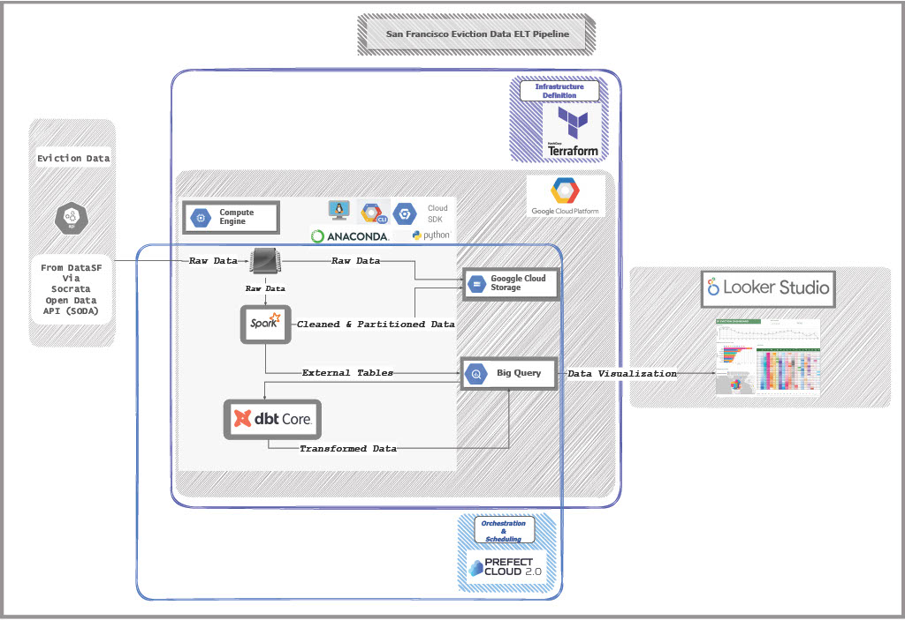
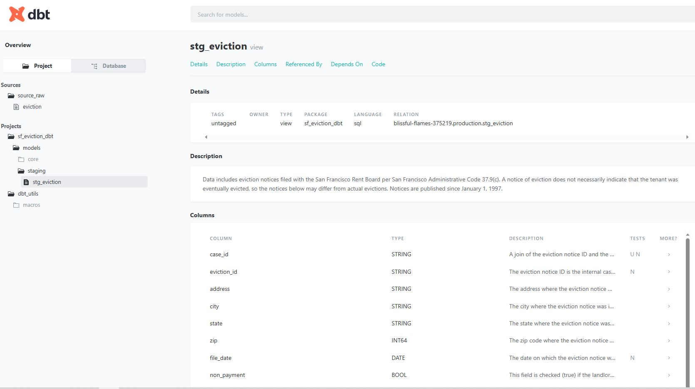
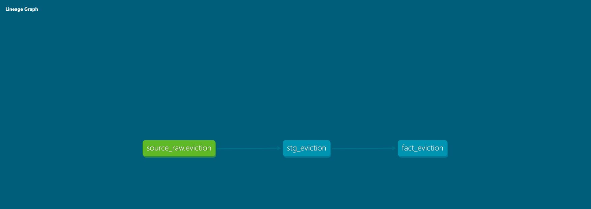
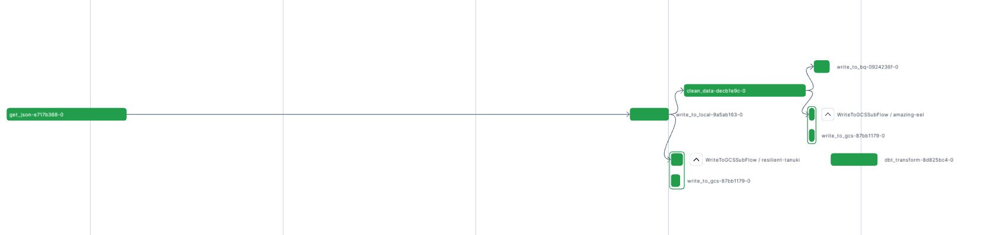
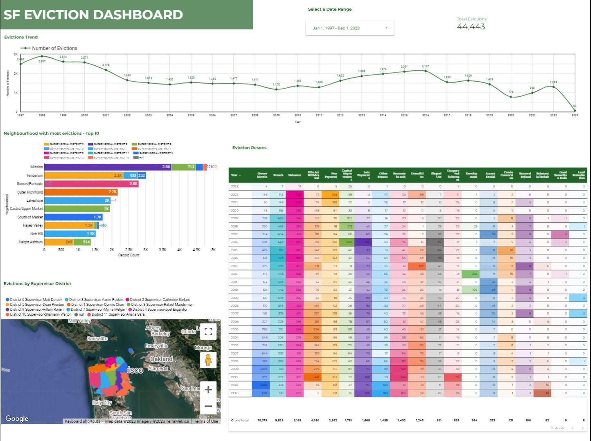

## San Francisco Data Eviction ELT - A Data Engineering Zoomcamp Capstone Project
---
The goal of this project is to build an end-to-end batch data pipeline to perform ELT on San Francisco City Eviction Data available at [DataSF](https://data.sfgov.org/Housing-and-Buildings/Eviction-Notices/5cei-gny5). And perform ELT (Extract Load Tranform) mothly in order to anlyse the eviction patterns from historical data to till date.

### Table of contents

- [Problem statement](#problem-statement)
  - [Dataset](#dataset)
  - [Proposed Solution](#proposed-solution)
- [Data Pipeline Overview](#data-pipeline-overview)
- [Technologies](#technologies)
- [Architecture](#architecture)
- [ELT Steps](#elt-steps)
- [The Dashboard](#the-dashboard)
- [Key Findings](#key-findings)
- [Reproduction](#reproduction)
- [Conclusion](#conclusion)
- [Future Work](#future-work)

## Problem statement
---
* ### ***Dataset***: 
    The Dataset selected for this project is the `Eviction Notice Dataset of San Francisco` obtained from [DataSF](https://data.sfgov.org/Housing-and-Buildings/Eviction-Notices/5cei-gny5). This data includes eviction notices filed with the San Francisco Rent Board per San Francisco Administrative Code 37.9(c). Notices are published since January 1, 1997. This publshing/update frequency of the dataset is `monthly`. The Data is extracted via Socrate Open Data API (SODA).

    The columns in the Dataset and their description is available [here](docs/info_dataset.md)

* ### ***Proposed Solution***:
    This project aims at extarcting this data from the source via API and building a BATCH ELT which will be scheduled to run monthly and update the connected dashbord for monthly Analytics & Reporting. 

## Data Pipeline Overview 
---
This is a Batch Pipeline which will perform ELT on the 1st of every month at 00:05 am (as source data is updated monthly at the end of each month). 

The ELT steps include:

* **Extract** dataset from DataSF via API and load the raw data into the Datalake
* Clean & partition data and load it to Datalake 
* **Load** the Clean & Partitioned Data from Datalake into external tables in the Datawarehouse
* **Transform** the data in the Datawarehouse
* **Visualize** the data by creating a Dashboard

## Technologies 
---
* Cloud: ***GCP***
* Infrastructure as code (IaC): ***Terraform***
* Workflow orchestration: ***Prefect***
* Data Wareshouse: ***BigQuery***
* Batch processing: ***Spark***
* Data Transformation: ***dbt-core***
* Dashboard: ***Looker Studio***
* Software Building Automation Tool: ***Make***
* Virtual Environment: ***Anaconda***
* CICD: ***Git***

## Architecture
---

## ELT Steps

Steps in the ELT are as follows:

1. A Project is created on ***GCP*** 
1. SODA API keys and secrets are obtained by creating an account on DataSF, which will be used to extract the data from the source
1. Infrastructure for the Project is created using ***Terraform*** which creates the following:
    * Datalake : ***Google Cloud Storage Bucket*** where the raw and cleaned-partitioned data will be stored
    * Data Warehouse: Three Datasets on ***BigQuery*** namely `raw`, `staging` and `production` are created in order to store the tables/views during different stages of ELT
    * Virtual Machine: A Linux ***Compute Engine*** to schedule and run the pipeline on
1. ***Prefect Cloud API*** is obtained by creating an account on Prefect Cloud
1. The Pilpeline for ELT is created on the VM and is scheduled for monthly execution. It is orchestrated via ***Prefect Cloud***; which does the following tasks
    * Extracts raw data from source via ***Socrate Open Data API***
    * Loads raw data to GCS Bucket
    * Cleans and Partitions the raw data using ***Apache Spark***
    * Loads the cleaned and partitoned data as parquet files to GCS
    * Creates External table & Non-partitioned table in the `raw` Dataset in BigQuery by pulling data from GCS. 
        
        ***Note***: Partitioned or Clustered tables were not created as the dataset produced too many partitions (more than what BigQuery permitted)

    * Transforms Data from BigQuery using ***dbt-core*** and creates the following in the dev/prod Dataset (along with Tests and Documentation)
        - the view `stg_eviction` - for staging data and 
        - fact table `fact_eviction` - which contains the latest updated record for each eviction case till date 
    
     

    * DOCUMENTATION ON DBT-CLOUD: 
     
    

    * LINEAGE GRAPH ON DBT-CLOUD:
     
    

    * ELT PIPELINE VISUALIZATION  ON PREFECT CLOUD 
     
    
1. Transformed Data from BigQuery is used for Reporting and Visualization using Looker Studio to produce Dashboards

## The Dashboard: 
---
The dashboard is accessible from [here](https://lookerstudio.google.com/reporting/688e19ba-3476-45f2-9dba-94d813bb9328)

## Key Findings
---
The data from BigQuery table `fact_eviction` is blended with [Supervisor Dataset](https://data.sfgov.org/Geographic-Locations-and-Boundaries/Supervisor-Districts-2022-/f2zs-jevy/data?no_mobile=true) on Looker Studio to develop Visualizations; to answer some key questions.

The questions that were aimed to answer and the corresponding findings are as below:

1. What has been the trend of overall evictions over the years in San Francisco?

    The trend has been cyclical co-relating with the economic outlook in the city but overall it has been trending downwards with a maximum of 2897 evictions in 1998 to a low of 1200 evictions in 2022. The dip in evictions in the past couple of years are primarily due to eviction restrictions in 2020 and 2021 as a result of Covid. But it will be interesting to observe how the trend changes in the coming months and years as the restrictions are now finally lifted.

1. What is the most recorded reason for eviction? 

    Looking at the heatmap, it is evident that ***Owner Movein*** has been the most recorded reason for eviction. But in recent years, this reason for eviction has become ***Nuisance***

1. Over the years, what has been the least recorded reason for eviction?

    Over the years that data has been available, the least number of recorded reason for eviction has been for ***Lead Remediation*** 

1. What are the top 3 reasons for eviction recorded over the last 10 years?
    
    The top 3 reasons are 
    - Breach of contract
    - Nuisance 
    - Owner movein

1. Which neighbourhood has seen the most evictions in 2022?

    The neighbourhood which saw most evictions is ***Financial Distriction/South Beach***

1. Which neighbourhood has seen the lowest evictions in 2022?

    The neighbourhood which saw lowest evictions is ***Mission Bay***. 

1. Which supervisor has the most challenges w.r.t evictions in SF in 2022?
    
    Supervisor ***Matt Dorsey*** had the most number of evictions to deal with . This data could be utilized to ensure that the teams are sized right in the respective districts. 

1. Looking at the trend of data, what would be your recommendation in the way that data is recorded?
    
    Given the trend of data, that ***Nusiance*** and ***Breach*** numbers have been increasing, the recommendation would be to break down these 2 reasons to better understand the exact reasons. This will allow the city council to take targeted actions to address this concern. 

## Reproduction:
---
You can recreate and run the project by following the step by step instructions [here](docs/ProjectReplication.md)

## Conclusion
---
Through this project we were able to successfully build a ELT pipeline end to end which is scheduled to run monthly. And as a result we have a mothly updated list of eviction notices filed in the city of San Francisco which can then be visualized via the Dashboard on Looker Studio. This helps us get some useful insights on the latest eviction trends and patterns.

## Future Work
---
- Combine data about neighbourhoods and districts from other sources and make the reporting more rich.
- Use DataProc to perform Spark job
- Create a normalized data structure when using more data sources
- Setup GCP Service Account and Permissions via Terraform

[Back To Top](#data-engineering-zoomcamp-capstone-project)