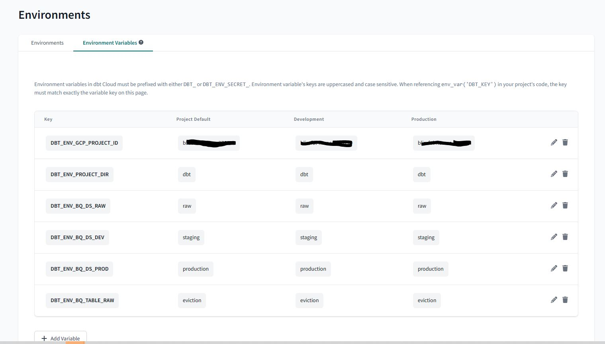

# Project Creation

## REQUIREMENTS - Local Machine

Below are the required applications on the local machine

### Google SDK
* Download from [here](https://cloud.google.com/sdk/docs/downloads-interactive#linux-mac)
* Required on the local machine
* VM comes with this pre-installed

### Terraform
* Download from [here](https://developer.hashicorp.com/terraform/downloads)

## CREATING GCP PROJECT VIA CLI & TERRAFORM

### Initial Setup
1. Clone the project 
```bash
git clone https://github.com/sanyassyed/sf_eviction.git
cd sf_eviction
```
2. Change the name of the `env_boilerplate` file to .env

### PROJECT CREATION VIA CLI
- [Documentation](https://cloud.google.com/sdk/docs)
1. Create the GCP Project by executing the below from the project folder in the terminal

        ```bash
        # Follow instructions to setup your project and do the intial project setup
        gcloud init --no-browser
        # Select Option 2 - Create a new configuration
        # Enter configuration name (enter the project name here): sf-eviction
        # Choose the account you would like to use to perform operations for this configuration: 1 (your gmail account)
        # Pick cloud project to use: 5 (Create new project)
        # Please enter project id: sf*******3

        # To check that all is configured correctly and that your CLI is configured to use your created project use the command
        gcloud info
        ```
    - Add the following values to your .env file
        * GCP_PROJECT_ID - the one you entered above
        * GCP_SERVICE_ACCOUNT_NAME - name to assign to your service account
        * GCP_ZONE - the region for your project
        * LOCAL_SERVICE_ACCOUNT_FILE_PATH=credentials/gcp-credentials.json - this is where your credentials will be downloaded
    - Create a `credentials` folder where your .json file will be saved

1. [Enable billing](https://support.google.com/googleapi/answer/6158867?hl=en) for the project on the GCP Console
1. Enable API's, create Service Account, setup Access via IAM Roles & Download Credentials

        ```bash
        # set the environment variables from the .env file
        set -o allexport && source .env && set +o allexport
        # 1 Enable API's for the project
        gcloud services enable iam.googleapis.com \
                compute.googleapis.com \
                bigquery.googleapis.com 
        # 2 Create Service Account
        gcloud iam service-accounts create $GCP_SERVICE_ACCOUNT_NAME --display-name="Master Service Account"
        # 3 Add access for the Service Account via IAM Roles
        # We create IAM roles for the service account
        gcloud projects add-iam-policy-binding $GCP_PROJECT_ID --member='serviceAccount:'"$GCP_SERVICE_ACCOUNT_NAME"'@'"$GCP_PROJECT_ID"'.iam.gserviceaccount.com' --role='roles/storage.admin'
        gcloud projects add-iam-policy-binding $GCP_PROJECT_ID --member='serviceAccount:'"$GCP_SERVICE_ACCOUNT_NAME"'@'"$GCP_PROJECT_ID"'.iam.gserviceaccount.com' --role='roles/storage.objectAdmin'
        gcloud projects add-iam-policy-binding $GCP_PROJECT_ID --member='serviceAccount:'"$GCP_SERVICE_ACCOUNT_NAME"'@'"$GCP_PROJECT_ID"'.iam.gserviceaccount.com' --role='roles/bigquery.admin'
        gcloud projects add-iam-policy-binding $GCP_PROJECT_ID --member='serviceAccount:'"$GCP_SERVICE_ACCOUNT_NAME"'@'"$GCP_PROJECT_ID"'.iam.gserviceaccount.com' --role='roles/compute.instanceAdmin'
        gcloud projects add-iam-policy-binding $GCP_PROJECT_ID --member='serviceAccount:'"$GCP_SERVICE_ACCOUNT_NAME"'@'"$GCP_PROJECT_ID"'.iam.gserviceaccount.com' --role='roles/viewer'
        gcloud projects add-iam-policy-binding $GCP_PROJECT_ID --member='serviceAccount:'"$GCP_SERVICE_ACCOUNT_NAME"'@'"$GCP_PROJECT_ID"'.iam.gserviceaccount.com' --role='roles/iam.serviceAccountUser'
        gcloud projects add-iam-policy-binding $GCP_PROJECT_ID --member='serviceAccount:'"$GCP_SERVICE_ACCOUNT_NAME"'@'"$GCP_PROJECT_ID"'.iam.gserviceaccount.com' --role='roles/compute.osLoginExternalUser' # to add ssh keys to VM via CLI
        
        # gcloud projects remove-iam-policy-binding $GCP_PROJECT_ID --member='serviceAccount:'"$GCP_SERVICE_ACCOUNT_NAME"'@'"$GCP_PROJECT_ID"'.iam.gserviceaccount.com' --role='roles/compute.admin'
        # 4 Download the json credential file
        gcloud iam service-accounts keys create $LOCAL_SERVICE_ACCOUNT_FILE_PATH --iam-account=$GCP_SERVICE_ACCOUNT_NAME@$GCP_PROJECT_ID.iam.gserviceaccount.com
        # view all the IAM Roles added to the project
        gcloud projects get-iam-policy $GCP_PROJECT_ID
        ```
### PROJECT INFRASTRUCTURE CREATION VIA Terraform 
1. build the project infrastructure via Terraform as follows 
```bash
# set the env variables
set -o allexport && source .env && set +o allexport
# run terrafrom from parent directory
# initialize the folder
terraform -chdir=terraform init
terraform -chdir=terraform plan
terraform -chdir=terraform apply
# if any errors the destroyall that you created as follows
terraform -chdir=terraform destroy
```
1. Now check the GCP Console to make sure all resources are created

### SSH Keys CREATION FOR THE VM
1. Generate ssh keys to connect to the VM [Documentation](https://cloud.google.com/compute/docs/connect/create-ssh-keys)
```bash
cd ~/.ssh
ssh-keygen -t rsa -f ~/.ssh/id_eviction -C project_user -b 2048
# Remember the passphrase as you need it when sshing into the machine
```
1. Now two keys should be created in the .ssh folder id_eviction (private key) and id_eviction.pub (public key)
1. Goto the GCP Console on the Browser into this project
    - Goto Metadata > SSH Keys tab > Click Edit > Click Add item > Add the public key here

### Start the VM & SSHing into it
1. Start the VM and get the External IP
    ```bash
        gcloud compute instances start $GCP_COMPUTE_ENGINE_NAME --zone $GCP_ZONE --project $GCP_PROJECT_ID
    ```
1. Make a note of the External IP
1. SSH into VM as follows:
    ```bash
        ssh -i ~/.ssh/id_eviction@<external_ip>
    ```

## EXECUTING PROJECT ON THE VM

1. Clone the Project repo on the VM
    ```bash
    git clone https://github.com/sanyassyed/sf_eviction.git
    ```
2. Replace the env_boilerplate file with .env file from your local system

## SOFTWARE REQUIREMENTS - Local Machine

Below are the required API's and Applications needed for this project and the instructions to install them on the VM.

NOTE: All the installations are from the `root directory`

1. Make

    Install the `make` software as follows:

    ```bash
        sudo apt install make
    ```
1. Java, Spark & Miniconda

    We are going to install these using the Makefile which is in the `sf_eviction` project folder which needs to be copied to the system root directory first

    ```bash
        # Execute the below in the system root directory
        # Copy the Makefile to system root
        cp sf_eviction/Makefile .
        # install java, spark & miniconda as follows
        make install-java
        make install-spark
        make install-conda
    ```
1. Virtual conda env with pip 
    * Goto the Project Directory 
        ```bash
            cd sf_eviction
        ```

    * Install the virtual conda env with pip and python 3.10.9 as follows
        ```bash
            conda create --prefix ./.my_env python=3.10.9 pip
            conda activate .my_env
            pip install -r requirements.txt
        ```

## API REQUIREMENTS
* TODO:
* SODU API Keys:
    - `API_KEY_ID` & `API_KEY_SECRET` are needed for extracting Eviction data for this project. Find the instructions [here](docs/info_api.md) to get your key.
* PREFECT CLOUD API:
    - Get your Prefect API Key by following instructions [here](https://docs.prefect.io/latest/ui/cloud-api-keys/)
* Add the keys to the .env file

>PREFECT
TODO: *******************************
1. Install prefect in the virtual env
    ```bash
    # In a conda environment, install all package dependencies with
    conda activate .my_env/
    pip install -r requirements_prefect.txt
    # add the below to requirements_prefect if not already added
    pip install "prefect-gcp[cloud_storage]" # Cloud storage apapter for creating GCS Block
    pip install "prefect-gcp[bigquery]" # for creating BQ Block
    ```

2. Use Prefect Cloud [Option 2: the other option is to use the local prefect orion for which you will use `prefect orion start`]
* You must do this step first as the blocks will be created on Prefect Cloud once you log into it using API
    * First Create a Prefect Cloud account
    * Get the API as follows:   
        - To create an API key, select the account icon at the bottom-left corner of the UI and select your account name and the cog-wheel. 
        - This displays your account profile.
        - Select the API Keys tab on the left
        - Select the API Keys tab. This displays a list of previously generated keys and lets you create new API keys or delete keys.
        - Create sf_eviction key and add this data to the .env file as PREFECT_CLOUD_API
    ```bash
    source env_variables.sh
    prefect cloud login -k $PREFECT_CLOUD_API # or ${PREFECT_CLOUD_API}
    ```
    * Now you can use the Prefect cloud to register blocks and run your flows

4. Create Prefect Blocks via code
    * The block creation is done in the file `create_prefect_blocks.py`
    * In this file we created 
        - A GCP Credentials Block - this is to connect to the GCP account
        - A GCS Bucket Block - To access the Buckets in GCS
        - A BQ Bucket Block - To connect and access BQ
    * NOTE: Block names must only contain lowercase letters, numbers, and dashes
    * Run the below to register the blocks created via the .py file. [Ref](https://docs.prefect.io/concepts/blocks/)
    ```bash
    # Run the create_prefect_blocks.py and register the block
    prefect block register --file create_prefect_blocks.py
    ```
    Now for this project we will always connect to the Prefect orion cloud, pull the blocks from there and use it for running our flows.

5. Create flows in ingest.py to
    - Pull raw data from the web
    - Store on VM locally
    - Write Raw data to GCS
    ```bash
    # from project root folder sf_eviction
    # make sure the virtual envi is activated and prefect cloud is logged in if not do the following steps to login
    conda activate .my_env/
    source env_variables.sh
    prefect cloud login -k $PREFECT_CLOUD_API
    # prefect block register --file create_prefect_blocks.py
    # Only for testing
    python flows/ingest.py
    ```
    - This will create a new folder called data_eviction in the project root folder with the data
    - This data will then be read and written to GCS
    - You can check the flow status on Prefect Cloud UI

6. Create Deployment
    * A flow can have multiple deployments and you can think of it as the container of metadata needed for the flow to be scheduled. This might be what type of infrastructure the flow will run on, or where the flow code is stored, maybe it’s scheduled or has certain parameters. [Ref:](https://github.com/discdiver/prefect-zoomcamp/tree/main/flows/03_deployments)

    ```bash
    # to deploy the flow with a schedule, it should then be available on prefect cloud under Deployments
    python flows/deploy_ingest.py
    # inspect the deployment to check the parameters and schedule
    prefect deployment inspect ParentFlow/etl_web_to_gcp
    # start the agent
    prefect agent start --work-queue "development"
    # in detached mode use `screen -A -m -d -S prefectagent prefect agent start --work-queue "development"`
    # run the deployment
    prefect deployment run ParentFlow/etl_web_to_gcp
    ```
7. Iteration 2- Add more tasks
     - To pull raw data from GCS and read into spark session
     - Transform it
     - Clean it
     - Push it to GCS and create external table in BQ

### SIMPLIFIED:
* NOTE:
    - The datset (`raw`) where the data needs to be pushed to should be created already in BQ
```bash
cd sf_eviction
conda activate .my_env
# open flows/ingest.py to modify the code to ingest
# open flows/deploy_ingest.py to modify the deployment file
source .env
export $(cut -d= -f1 .env)
prefect cloud login -k $PREFECT_CLOUD_API
prefect block register --file flows/create_prefect_blocks.py
python flows/deploy_ingest.py
# goto prefect cloud using login s***08@gmail.com and check if the deployment is set there
# on VM-start the agent
# in detached mode use 
screen -A -m -d -S prefectagent prefect agent start --work-queue "development"
# force run the deployment for testing or you can let it run on schedule
prefect deployment run ParentFlow/etl_web_to_gcp
# Goto the agent screen or prefect-Cloud to view the execution
# screen -r prefectagent
# Stop the prefect agent 
screen -r prefectagent # whatever screen name you gave
Ctrl + C
prefect cloud logout
# stop the scedule on Prefect-Cloud UI if required
```
* Now there should be 
    1. raw and clean data available on GCS and 
    2. clean data available in the tables `eviction_external` & `eviction` in the dataset `raw` on BQ.

* Next run the dbt models on the data in the table `raw.eviction`

>DBT
## dbt-core vs cloud
* Develop the project in dbt cloud and then deploy (Production) it from VM
* Documentation is easier in the dbt-cloud IDE therefore we are taking this two step approach
* If using dbt-core with BQ you need to install the dbt-core adapter for BQ
* Make sure a `staging` and `production` datasets are already created on BQ via Terraform

## Initial setup
* On the VM(in the project directory)
    * Make a new directory called `dbt` in the project root directory 
    * All dbt related development will be done in this directory
    * Push this to the remote repo so it's available to dbt-Cloud when it clones the repo
    ```bash
    cd sf_eviction
    mkdir dbt
    echo this is a test file > dbt/test.txt # create a test file in this new repo so we can push it to git
    ```

## DBT-CLOUD (OPTION 1)

We will use dbt-cloud to DEVELOP (TEST & DOCUMENT) the project and dbt-core to deploy the project as mentioned before

### Setup
* Setup the dbt-project on `dbt-cloud`:
    * Goto [dbt-cloud](https://www.getdbt.com/signup/) and create an account
    * Select BQ as your DB and select next
        
    * Then upload the json credentials
        
    * All details will be automatically populated
        
    * Then enter the details for the Development Credentials as follows and Test the connection and select next:
        - Name (of the project) - sf_eviction_dbt (you have to edit this later if you don't see this option now at `Project Details -> Name & Project Subdirectory` NOTE: workaround is to delete the dbt project and start again and you will see the options to set these right at the beginning)
        - Subfolder - dbt 
        - Connection - BigQueryEviction
        - Dataset - staging
        - Target Name - sf_eviction_dbt
        - Threads - 4
        - 
    * Setup a connection to the a Repository
        - Select GitHub
        - Connect a GitHub account
        - Log into GitHub and connect the accounts
        - Once it's linked it shows as below in the settings
        - 
        - Select the down arrow and select the button to choose the repo to import
        - 
        - This will take you to GitHub where you can select the repo to give access to
        - Select the `Develop` button on the top left and from the drop down select `Environments`
        - 
        - Here you can select the repo to import to your dbt project
        - Then Select the `Start Developing in the IDE` option; this will import your project repo sf_eviction to the IDE
* Setup the IDE:
    1. Make sure the dbt project home directory is set to the `dbt` folder
        
    2. Then select the `Create Branch` from the drop down button as shown in the above image and name the branch `develop_dbt`
    3. Then initialize the poject by selecting the `Initialize dbt project button`
    4. This should create the dbt project folders under the dbt folder as follows
        
    5. Now you can start developing your dbt project


### DEVELOPMENT 

Now we perform Transformations on the data **[the `T` part of ETL or ELT]**

* Goto dbt-cloud [Develop](https://cloud.getdbt.com/develop/158847/projects/232754) tab
* In the file dbt_project.yml edit the following: [Ref Video](https://youtu.be/iMxh6s_wL4Q?list=PL3MmuxUbc_hJed7dXYoJw8DoCuVHhGEQb&t=248)
    
    ```yml
    name: 'sf_eviction_dbt'
    profile: 'dev'
    .....
    .....
    .....
    models:
        sf_eviction_dbt:
            # Applies to all files under models/staging/
            staging:
                materialized: view
            # Applies to all files under models/core/ 
            core:
                materialized: table
    ```
* In the `dbt/models` folder create the following 
    - `staging` folder - where we will be creating models to build views from the raw data perform typecasting, renaming of fields etc on it
        - `schema.yml` file in the staging folder where we will mention the source project, dataset and table(s) name
        - `stg_eviction.sql` file in the staging folder where we will define the data to be imported to create the stg_eviction ~~table~~ view in the target(dev/prod) dataset
    - `core` folder - where we will be creating models that we will be exposing at the end to the Visualization/BI tool etc. They usually help in creating fact or dimention tables.
    - `fact_eviction.sql` file in the core folder that will create a fact table called `fact_eviction` which will only have records of eviction_id's with the latest update date. i.e only one record per id

* Install PACKAGES
    - Create a new file in the dbt project folder called  `packages.yml`
    - To download the packages written in this file to the packages folder; use the command `dbt deps`
    - After running this command check the packages folder to see if the package has been downloaded
* Run the dbt project using the command
    ```bash
    # testing
    dbt deps
    dbt run 
    # to only run the stg_eviction model  on the entire dataset
    # dbt run --select stg_eviction --var "is_test_run: false"
    ```
    - This will create and populate the stg_evaluation table in the DW in the target(dev = staging dataset/prod = production dataset) dataset

* ITERATION 2 & RUNNING THE DEV
    - Going to transform the eviction data now
    - I was unable to partition the table when loading from external table in BQ (via the ingest.py code) as the file_date column resulted in too many partitions.
    - Going to add a location column
    - Add a unique id column called case_id which would be a concatenation of the eviction_id and updated date
    - Used a util for generating the surrogate key by hashing the case_id
    - Added documentation to models/staging/schema.yml
    - Now build the project as follows:
        ```bash
        # testing
        dbt deps
        dbt build
        # to load the entire dataset
        # dbt build --var 'is_test_run: false'
        ```
* COMMIT-SYNC & MERGING
    - Use the  `commit & sync` button for version control.
    - This will commit and push the code to the `develop_dbt` branch
    - To merge the `develop_dbt` branch with the `MAIN/MASTER` branch you will have to use the `Create a Pull request on Git`

### PRODUCTION
In this step we will deploy the project. This deployment will be run against a different schema - i.e qill write to a different dataset like `production` dataset in the DW [Reference Video](https://www.youtube.com/watch?v=rjf6yZNGX8I&list=PL3MmuxUbc_hJed7dXYoJw8DoCuVHhGEQb&index=37)
* PR
    - Here we will deploy the project by making a PR (Pull Request) to merge into the main branch
    - Finish all the development and documentation and testing and then commit & sync
    - Select `Pull from 'master'` if required before making a PR.
    - Then select `Create a pull request on GitHub`
    - This will take you to GitHub, there select `Create pull request` button
    - Commit and create the request
    - Then confirm the merge request with a comment
    - You will find all the dbt related folders in the dbt folder
* Creating Production Environment
    - Goto dbt-cloud
    - Select the `Pull from 'master'` if required
    - Goto the `Deploy` tab and select `Environments` from the drop down
    - Select the `Create Environment` button
    - Fill the details as follows:
        - Name: Production
        - Environment Type: Deployment
        - dbt Version: Latest 1.4
        - Dataset: production
        - Select `SAVE`
* Creating Jobs in Production Environment
    - Select `Create One`
    - Fill the details as follows:
        - Job Name: eviction_deploy
        - Environment: Production
        - dbt Version: Latest 1.4
        - Target Name: prod
        - Threads: 4
        - Generate docs on run: Check
        - Commands: dbt build --var 'is_test_run: false' (this command = dbt seed + dbt run + dbt test)
        - Schedule: 5 7 1 * * (The dbt will run two hours after the ingest model runs i.e at 2:05 am on the 1st of every month; dbt accepts only UTC timezone; hence its 7 am in the cron schedule)
        - Select `SAVE`
    - Select `Run Now` to test if it works and populated the production table in the DW
        - Click on the job to view the details of the job as it runs
        - 
        - Select `View documentation` to view the documentation
    - Make the documentation available for the project `sf_eviction_dbt` (we set this in the `dbt_profiles.yml` file)
        - Goto the `Account Settings`
        - Select the project and select `Edit`
        - Under Artifacts in `Documentation` select the job name `eviction_deploy`
        - Select `SAVE`
        - This will activate the documentation under the `DOCUMENTATION` tab next to `Develop` & `Deploy` on top of dbt-Cloud
* Now the models will run on schedule by pulling data from the dbt folder from the main branch

## DBT-CORE (OPTION 2)

We have developed (documented and tested) and deployed the dbt models on dbt-cloud. Now we will try to develop & deploy it from dbt-core so it can be used from the VM also if we prefer that. 
* [Reference Video](https://www.youtube.com/watch?v=Cs9Od1pcrzM&list=PL3MmuxUbc_hJed7dXYoJw8DoCuVHhGEQb&index=38)
* [Reference Instructions by me](https://github.com/sanyassyed/data-engineering-zoomcamp-project/tree/main/homework/workshop_piperider)
* Remember to do development in the `develop_dbt` branch
* We will now do all the setup for dbt-core in this branch, so move to this and first make sure it is same as main branch by doing pull
    ```bash
    # Checkout to the develop_dbt branch
    git checkout dbt_develop
    # pull the changes from main branch
    git pull origin master
    ```
* Edit the dbt_project.yml
    - Change the profile from dev to `profile: 'sf_eviction_dbt'` 
* Create a profiles.yml file in the project root folder and specify the values for the two targets(dev and prod) and use environment variables
* Activate the virtual conda env & install dbt-core with BQ adapter
    ```bash
    conda activate .my_env
    # install dbt-core and dbt with bigquery adapter and piperider with bigquery adapter
    pip install dbt-core dbt-bigquery 'piperider[bigquery]'
    
    # set the env variables such that they are available to all child processes
    source .env
    export $(cut -d= -f1 .env)
    # This command uses cut to extract the variable names from .env and passes them as arguments to the `export` command and exports those variables which have already been set by source .env
    # For eg: `export $DBT_ENV_PROJECT_DIR`; does this for all variables
    
    # Install dbt deps and build dbt models by specifying the project directory
    dbt deps --project-dir $DBT_ENV_PROJECT_DIR # downloads the dependencies for current dbt version
    
    # test dbt-core and big-query connection
    dbt debug --project-dir $DBT_ENV_PROJECT_DIR
    # use --profile profiles.yml if the profiles.yml is in the ~/.dbt/profiles.yml folder
    ```
* NOTE: Here is what each part of the command means:
    - export is a shell command that sets an environment variable.
    - $() is a command substitution that runs the command inside the parentheses and replaces it with the output of that command.
    - cut is a command that is used to extract sections from each line of a file.
    - -d= specifies that the delimiter used to separate fields in the file is the equals sign (=).
    - -f1 specifies that only the first field should be returned. In this case, the first field is the environment variable name.
    - .env is the file containing the environment variable names.

### BUILD in DEV
* The below should make a view called `stg_eviction` and a fact table called `fact_evition` in the `staging` dataset.
```bash
# Set the env variables using 
source .env
export $(cut -d= -f1 .env)
# build models on staging dataset in BQ
dbt build --var 'is_test_run: false' --project-dir $DBT_ENV_PROJECT_DIR
``` 
* Once working well push the code to the dev branch (develop_dbt) 
```bash
git add .
git commit -m "CICD: dbt dev working from VM"
git push -u origin develop_dbt
``` 
* Then create a pull request to the main branch on GitHub
    - Goto the dev branch on GitHub
    - Select the Pull requests tab
    - Create a pull request to merge to main there

### BUILD in PRODUCTION
* Once the dev branch `develop_dbt` is merged with the main move to the main branch
```bash
git checkout master
git pull
# make sure you have activated the virtual env
# Set the env variables using 
source .env
export $(cut -d= -f1 .env)
# test the connction to production dataset
dbt debug --project-dir $DBT_ENV_PROJECT_DIR -t prod
# build models on production dataset in BQ by specifying the target as prod which will point to the production dataset on BQ
dbt build --var 'is_test_run: false' --project-dir $DBT_ENV_PROJECT_DIR -t prod
``` 
* The above should make a view called `stg_eviction` and a fact table called `fact_evition` in the `production` dataset.

NOTE: For the dbt project to run in dbt-cloud with the env variables set them here in dbt-cloud:

### SIMPLIFIED
1. DEVELOPMENT
    if your master is uptodate or ahead with the prev development
    ```bash
    git checkout develop_dbt
    git pull -origin master
    dbt build --var 'is_test_run: false' --project-dir $DBT_ENV_PROJECT_DIR
    ```
2. PRODUCTION
    * After running the ingestion code via Prefect
    * NOTE: Need to add steps to install dbt
    ```bash
    dbt build --var 'is_test_run: false' --project-dir $DBT_ENV_PROJECT_DIR -t prod
    ```
## DBT-Core X Prefect
### Option 1 
Use BLOCKS instead of using `profiles.yml`
We will use Prefect to schedule the running of the dbt models via dbt-core [Reference](https://prefecthq.github.io/prefect-dbt/#saving-credentials-to-block)

1. **Install the prefect plugin for dbt-core** which is the `dbt Core-cli` as follows
```bash
conda activate .my_env
pip install "prefect-dbt[cli]"
```
2. **Create Prefect Blocks** in the flows/create_prefect_blocks.py file for ONE EACH FOR DEV & PRODUCTION. Once you create these Blocks you don't need the profiles.yml file. But if you don't want to use the blocks for dbt then look at  below for the alternative method
    1. dbt CLI BigQuery Target Configs Block for TARGET Dataset 'staging/prod'
    2. dbt CLI Profile Block for PROFILE 
    3. dbt Core Operation for defining the dbt COMMANDS to run 
3. Check on Prefect Cloud UI if the new 6 Blocks have been created
4. Create a task in flows/ingest.py to run the dbt models
5. Then run the flows via Deployment

### Option 2
dbt-core X Prefect without Blocks
 
```python
from prefect_dbt import DbtCoreOperation
@task
def dbt_transform() -> None:
    """Run dbt transformations on data in BQ by building dbt models """

    dbt_path = f"{os.getcwd()}/dbt"

    dbt_op = DbtCoreOperation(
        commands=["dbt build --var 'is_test_run: false' -t prod"],
        working_dir=dbt_path,
        project_dir=dbt_path,
        profiles_dir=os.getcwd(),
    )

    dbt_op.run()
```

### EXTRA INFO

* `profiles.yml` [Ref video:](https://youtu.be/1HmL63e-vRs?list=PL3MmuxUbc_hJed7dXYoJw8DoCuVHhGEQb&t=230)
    - This file stays outside your dbt project usually at ~/.dbt/profiles.yml
    - Here you define your connection details
    - You can have several targets under the SAME database eg: 
        - one for development (dev), 
        - one for production (prod). 
        - [How to create it-tutorial](https://youtu.be/Cs9Od1pcrzM?list=PL3MmuxUbc_hJed7dXYoJw8DoCuVHhGEQb&t=359)
    - Target dev would be used as the default target 
    - Then during PRODUCTION if you want to build the dbt project on the production dataset you can expicitly specify the target for production using the -t flag along with the build command as follows `dbt build -t prod` 

* `JINJA BLOCKS` :We will be using a lot of jinja blocks (which are within two curly braces) and can contain functions called macros that will turn into full codes during compile. For e.g:
    ```sql
    --file dbt/models/staging/stg_eviction.sql
    {{
        config(materialized='table')

    }}
    Select *
    from raw.eviction
    ```
     - The above jija code conatains the macro config (with the parameter `materialized` and the strategy set to `table`) which during compile will convert the parameter `materialized='table'` to a DDL/DML to the model (eg: core/stg_eviction model) we are writing to. TLDR: It creates the `CREATE TABLE` statement with the table name which is same as the .sql file name prefixed with the appropriate dataset name (which changes for dev and production)

     ```sql
     create table schema.stg_eviction as (
        Select *
        from raw.eviction
     )
     ```
     - The strategy could be set to 
        * table
        * view
        * incremental -use this if data does not change very often
        * ephemeral

* Macros used with jija
    - config - Automatically create the `CREATE TABLE` statement with the table/view name
    - source - resolves the table name for us with automatically prefixing the right dataset name based on target
    - ref - to refer to the tables/views that were created either using the dbt models or dbt seeds


>STARUP & SHUTDOWN

## Logging in: During Development
```bash
# local system
cd sf_eviction
source env.bashrc # to set the credentials for GCP
gcloud compute instances start $GCP_COMPUTE_ENGINE_NAME --zone $GCP_ZONE --project $GCP_PROJECT_NAME
# update the external ip in ~/.ssh/config
ssh $GCP_COMPUTE_ENGINE_NAME

# on the VM
cd sf_eviction
source env_variables.sh # set env variables with prefect api & pyspark path
screen -A -m -d -S jupyterscreen jupyter notebook --port=8888 # start jupyter nb
screen -ls # check if screen has started
conda activate .my_env/ # activate virtual env for the project
# if working with prefect
prefect cloud login -k $PREFECT_CLOUD_API # login into prefect cloud
screen -A -m -d -S prefectagentscreen prefect agent start --work-queue "development" # start agent
```
## Logging out:
```bash
#####Jupyter###
# Option 1
pgrep jupyter
# use the pid printed
kill pid
# Option 2
screen -ls
screen -r jupyterscreen # whatever screen name you gave
Ctrl + C
####Prefect####
# prefect agent
screen -r prefectagent # whatever screen name you gave
Ctrl + C
prefect cloud logout
```

>JOURNALING
### TODO:
* Next day 
    - [ ] Change the GCP_Credentials block to accept file and not dict
    - [ ] Move all credentials to the project root folder
    - [X] Test the dbt-core code with env_var on dbt-cloud
    - [ ] Transfer project to another GCP account
    - [ ] set scheduling for dbt-core
    - [X] dbt - test the code for production and set scheduling and look at the documentation in the UI
    - [X] Set the scheduling in the VM for dbt (Move the running of the code from dbt-cloud to dbt-core)
    - [X] consolidate commands/instructions to run the ETL part (Prefect part)
    - [X] Look into how data will be added to DB; about update options    Ans: look at the image on the phone
    - [X] test the flow with the prefect agent
    - [X] Add logging in the flows
    - [ ] Work on terraform
    - [X] replace the dataset name (sf_eviction also set this to raw) with dataset name credential (set this when using terraform to create the dataset)
    - [X] work on dbt-core locally
* Later in the project
    - [ ] use the point column for location
    - [ ] Pull data via API using offset
    - [ ] Add update/append instead of create table so when new data is pulled it updates the existing table
    - [X] Later modify the date to maybe seperate by month years etc
    - [X] Seperate lat and long info from the location column
    - [ ] Read json data directly into the pyspark df rather than write locally [find failed tests to do this in 05_api_json_data_write.ipynb]
    - [ ] Write the data from pyspark df directly to BQ and GCS - do this using Dataproc? 
    - [ ] Add more tables like neighbourhood table, district table etc [ref:](https://catalog.data.gov/dataset/?q=&sort=metadata_modified+desc&groups=local&res_format=CSV&tags=planning&tags=zoning&organization=city-of-san-francisco&ext_location=&ext_bbox=&ext_prev_extent=-164.53125%2C-80.17871349622823%2C164.53125%2C80.17871349622823) Try searching for San Francisco Neighbourhood, District Demographics
    - [ ] Remove `rn` column from 'fact_eviction` table
    - [ ] Add documentation for the fact_eviction model as well