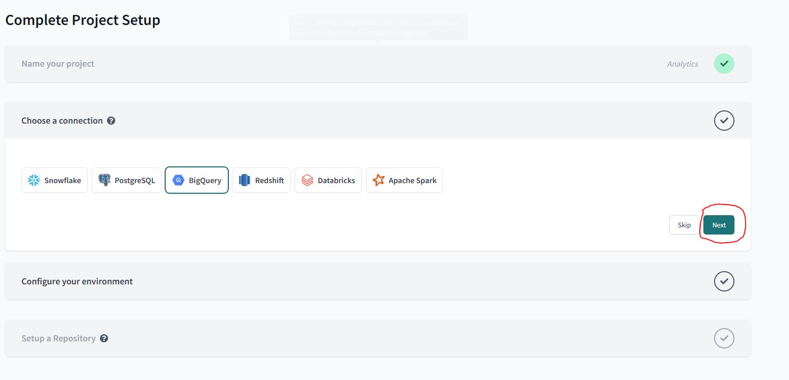
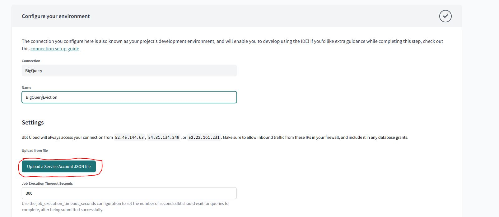
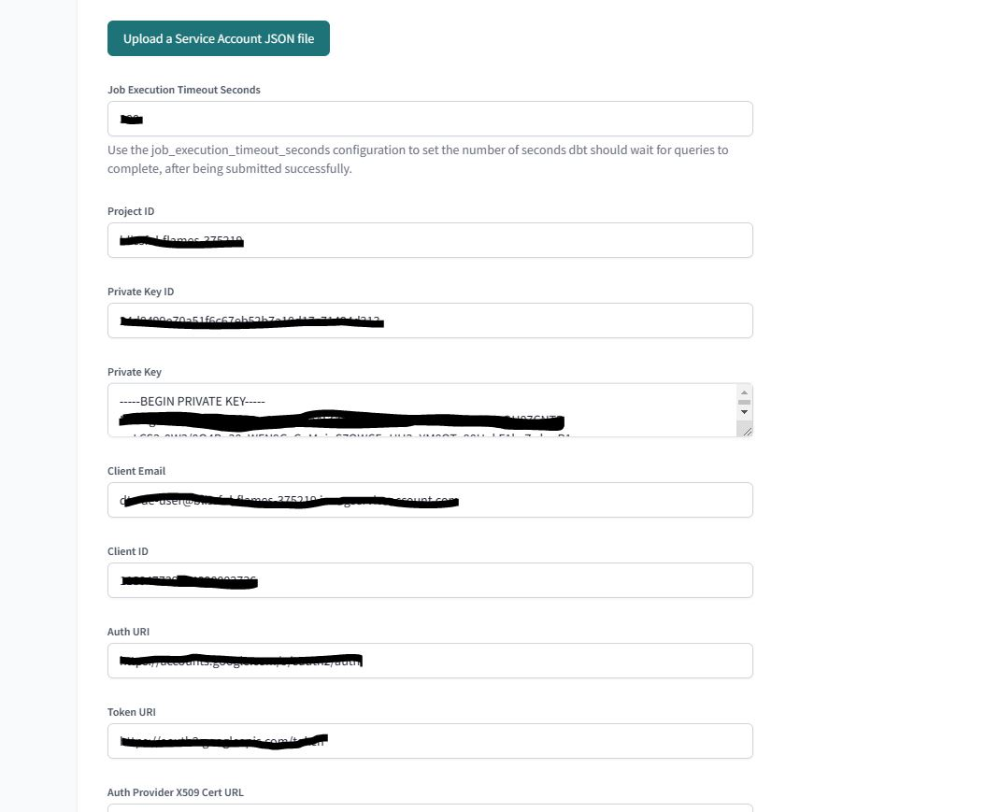
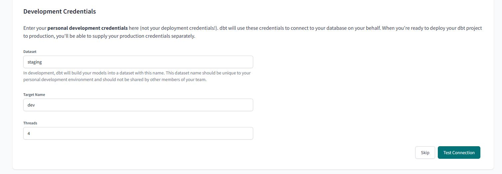
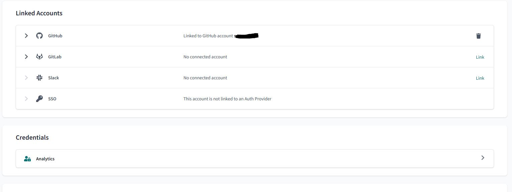
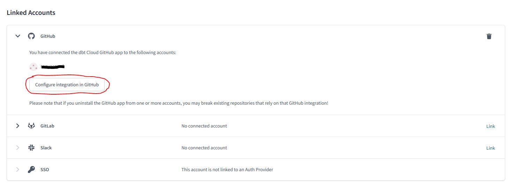
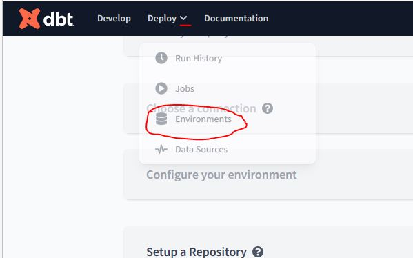
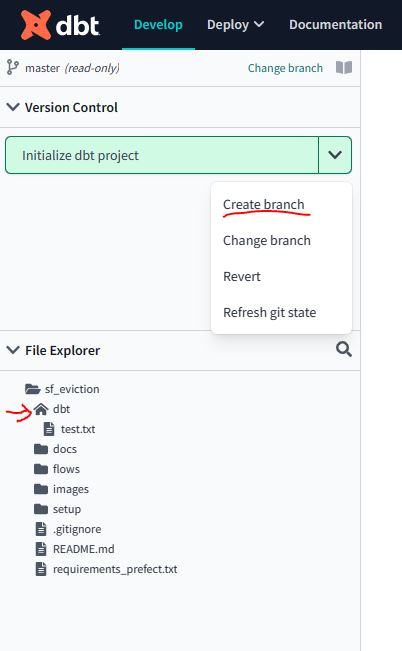
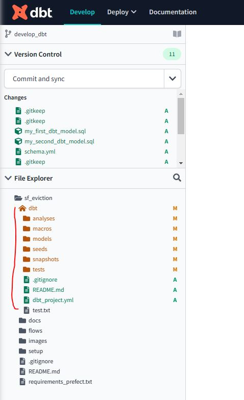
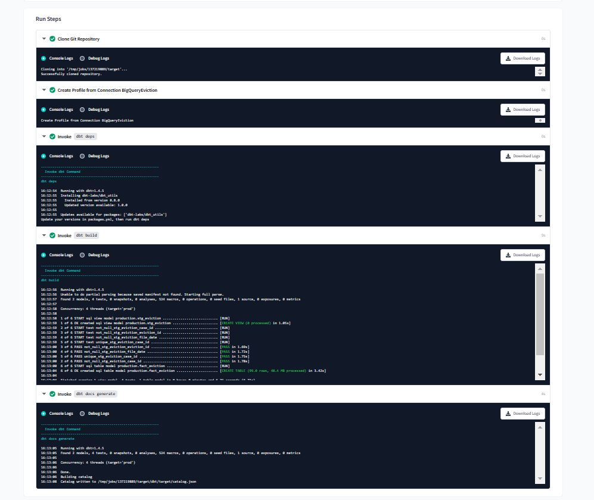

# Project Setup 
NOTE: Steps mentioned in this documentation are used to indicate the flow.

Here I have documented the entire project creation which will be helpful to recreate the project
Instructions for running the project will be created later.

>INITINAL SETUP

* Start the VM on GCP via CLI from the personal system- **Step 1**
    ```bash
    # Command to import environment variables in the windows os
    source env.bashrc
    gcloud compute instances start ${GCP_COMPUTE_ENGINE_NAME} --zone ${GCP_ZONE} --project ${GCP_PROJECT_ID}
    # Copy paste the Instance External IP in the ~/.ssh/config file
    ssh ${GCP_COMPUTE_ENGINE_NAME}
    ```
>GIT SETUP

Instructions to create a project folder and setup version control using GIT 

TODO: Edit and only keep instructions to clone repo using http - **Step 2**

## PERSONAL SYSTEM
* Creating a repo on the local system and pushing to git
    * Create a new folder for the project - sf_eviction
    * cd into sf_eviction
    * `git init`
    * `nano .gitignore` -> add files to be ignored
    * `git add .`
    * `git commit -m "CICD: Initial Commit"`
    * `git remote add origin https://github.com/sanyassyed/sf_eviction.git`
    * `git push -u origin master`
    * `username: sanyassyed`
    * `password <paste_the_personal_access_token_here>` -> you need to create this on the website of github and save the token securely for future use

## VM
Instructions to clone the project repo on a VM and enable pushing and pulling to and from repo respectively

* Connect remote VM to remote git repo via SSH
    ```bash
    # generate a ssh key pair 
    ssh-keygen -t rsa
    # if you want to give a different name enter the below else press enter
    /home/sanyashireen/.ssh/vm_rsa 
    # add this key to ssh-agent
    # start ssh agent 
    eval `ssh-agent -s`	
    # check if keys are already identified
    ssh-add -l -E sha256
        > The agent has no identities.
    # guide the ssh agent where the keys are stored
    ssh-add /home/sanyashireen/.ssh/vm_rsa
        > Identity added: /home/sanyashireen/.ssh/vm_rsa (sanyashireen@de-zoomcamp)
    # create a `config` file in .ssh folder
    nano config 
    # and write the below to file [Ctrl + O + Enter to save, Ctrl+X to exit]
    # write the path to the key from the root ~ and not /home
        Host github.com
            User git
            IdentityFile ~/.ssh/vm_rsa
    # add the public key to the git account on github.com
    # clone repo as follows using SSH
    git clone git@github.com:sanyassyed/sf_eviction.git
    # check the remote origin is set with ssh
    git remote -v
    # Check the SSH connection with repo from VM using
    ssh -T git@github.com
    # set the global variables
    git config --global user.email "sanya.shireen@gmail.com"
    git config --global user.name "sanya googlevm"
    # make changes in repo
    git add .
    git commit -m "CICD: Initial commit from VM"
    git push -u origin master
    ```

>PACKAGES & CREDENTIALS
* Goto Project Directory - **Step 3**
```bash
cd sf_eviction
```
## Requirements 
Below are the required API's, Applications needed for this project and the instructions to install them on the VM

### API's
* TODO:
* API Keys (`API_KEY_ID` & `API_KEY_SECRET`) are needed for extracting Eviction data for this project; find the instructions [here](docs/info_api.md) to get your key.

### conda 
* TODO:

### Java
* TODO: refer to week 5 de-zoomcamp

### Spark
* TODO: refer to week 5 de-zoomcamp

### Jupyter notebook
* TODO: Check if conda comes with jupyter notebook installed?
Maybe not required to run the project

>PROJECT VIRTUAL ENVIRONMENT & PACKAGES 
## Virtual conda env
* ` conda create --prefix ./.my_env python=3.10.9 pip` -> Path to install the virtual env in the current project directory with python 3.10 and pip
*  `conda activate .my_env` - to activate the virtual env - **Step 4 Option a**
* `conda activate` -> don't use deactivate just use `activate` to go to base

## Jupyter Notebook with different kernal 

Using jupyter installed on the system and  the kernel from conda virtual env [Ref](https://stackoverflow.com/questions/58068818/how-to-use-jupyter-notebooks-in-a-conda-environment) 

<p> We are going to use the pyhton in the conda virtual env and create a kernal and activate that in the system jupyter notebook </p>

1. Add the conda virtual env python to kernal
    
    ```python
    conda activate .my_env       # activate environment in terminal
    conda/pip install ipykernel  # install Python kernel in new conda env
    ipython kernel install --user --name=conda-myenv-kernel   # configure Jupyter to use Python kernel
    
    # Then run jupyter from the system installation or a different conda environment:
    conda activate               # this step activates the system conda
    jupyter notebook             # run jupyter from system
    ```
    
2. Select the `conda-myenv-kernal` in jupyter notebook form the `New` drop down box

### Start Jupter notebooks **Step 4 Option b**
```bash
conda activate # to goto base conda which has the jupyter installation
screen -A -m -d -S jupyterscreen jupyter notebook --port=8888 # to start jupyter in the background 
# This command launches a Jupyter Notebook server using the "screen" utility with the session name "jupyterscreen".
# Here is a breakdown of the different components of the command:
# screen: A terminal multiplexer that allows you to run multiple shell sessions within a single terminal window.
# -A: Adapt the terminal's size to the current screen size.
# -m: Start a new session without attaching to any existing sessions.
# -d: Detach the screen session after it has been started.
# -S jupyterscreen: Name the screen session "jupyterscreen".
# jupyter notebook: Launch the Jupyter Notebook server.
# --port=8888: Specify the port number on which the Jupyter Notebook server will run. In this case, it's set to port 8888.
# When you run this command, it will start a detached screen session with the name "jupyterscreen" and launch a Jupyter Notebook server on port 8888 within that session. This means that you can access the Jupyter # Notebook server from another terminal window or from a web browser.
# goto the browser and open http://localhost:8888 and select the virtual env kernal
# to stop jupyter notebook
pgrep jupyter
# use the pid printed
kill pid
# activate the project venv
conda activate .my_env/
```

### Installing packages on Conda Virtual env
* `pip install <name_of_the_package>`
* `python-decouple` -> used for setting up and using environment variable within the python code
* `ipykernel` -> to add the virtual conda kernal to the list of kernals available on Jupyter notebook

>ENVIRONMENT VARIABLES
### Environment Variables for the project

Add environment variables as follows [Ref](https://able.bio/rhett/how-to-set-and-get-environment-variables-in-python--274rgt5#:~:text=First%20install%20Python%20Decouple%20into%20your%20local%20Python%20environment.&text=Once%20installed%2C%20create%20a%20.env,to%20add%20your%20environment%20variables.&text=Then%20save%20(WriteOut)%20the%20file,stored%20in%20your%20.env%20file.)

* `pip install python-decouple`
* `touch .env` # create a new .env file
* `nano .env`    # open the .env file in the nano text editor and write the environment variables here
    * Now that you have your environment variables stored in a .env file, you can access them in your Python code like this:
    
        ```python
        from decouple import config, AutoConfig
        config = AutoConfig(search_path='.env')
        API_USERNAME = config('API_USER')
        API_KEY = config('API_KEY')
        ```
    * To specify a different path for .env refer [here](https://stackoverflow.com/questions/43570838/how-do-you-use-python-decouple-to-load-a-env-file-outside-the-expected-paths)

>GENERAL DOCUMENTATION
## Project Structure
TODO: later use tree command to copy paste updated structure 
```bash
sf_eviction/
├── terraform/
│   ├── main.tf
│   ├── variables.tf
│   └── ...
├── flows/
│   ├── __init__.py
│   ├── config.py
│   ├── main.py
│   └── ...
├── dbt/
│   ├── analysis/
│   ├── macros/
│   ├── models/
│   ├── snapshots/
│   ├── tests/
│   ├── dbt_project.yml
│   └── ...
├── README.md
└── setup.py
```
## Project Creation
>TERRAFORM
* Have the dataset names as and create these with terraform in the same region
    - raw (Data from BQ will be pushed here) **Currently its `sf_eviction` and need to change that
    - staging (Data from dbt after transformations will be pushed here in Dev)
    - production (Data from dbt after transformations will be pushed here in Production)

>PREFECT
1. Install prefect in the virtual env
    ```bash
    # In a conda environment, install all package dependencies with
    conda activate .my_env/
    pip install -r requirements_prefect.txt
    # add the below to requirements_prefect if not already added
    pip install "prefect-gcp[cloud_storage]" # Cloud storage apapter for creating GCS Block
    pip install "prefect-gcp[bigquery]" # for creating BQ Block
    ```

2. Use Prefect Cloud [Option 2: the other option is to use the local prefect orion for which you will use `prefect orion start`]
* You must do this step first as the blocks will be created on Prefect Cloud once you log into it using API
    * First Create a Prefect Cloud account
    * Get the API as follows:   
        - To create an API key, select the account icon at the bottom-left corner of the UI and select your account name and the cog-wheel. 
        - This displays your account profile.
        - Select the API Keys tab on the left
        - Select the API Keys tab. This displays a list of previously generated keys and lets you create new API keys or delete keys.
        - Create sf_eviction key and add this data to the .env file as PREFECT_CLOUD_API
    ```bash
    source env_variables.sh
    prefect cloud login -k $PREFECT_CLOUD_API # or ${PREFECT_CLOUD_API}
    ```
    * Now you can use the Prefect cloud to register blocks and run your flows

4. Create Prefect Blocks via code
    * The block creation is done in the file `create_prefect_blocks.py`
    * In this file we created 
        - A GCP Credentials Block - this is to connect to the GCP account
        - A GCS Bucket Block - To access the Buckets in GCS
        - A BQ Bucket Block - To connect and access BQ
    * NOTE: Block names must only contain lowercase letters, numbers, and dashes
    * Run the below to register the blocks created via the .py file. [Ref](https://docs.prefect.io/concepts/blocks/)
    ```bash
    # Run the create_prefect_blocks.py and register the block
    prefect block register --file create_prefect_blocks.py
    ```
    Now for this project we will always connect to the Prefect orion cloud, pull the blocks from there and use it for running our flows.

5. Create flows in ingest.py to
    - Pull raw data from the web
    - Store on VM locally
    - Write Raw data to GCS
    ```bash
    # from project root folder sf_eviction
    # make sure the virtual envi is activated and prefect cloud is logged in if not do the following steps to login
    conda activate .my_env/
    source env_variables.sh
    prefect cloud login -k $PREFECT_CLOUD_API
    # prefect block register --file create_prefect_blocks.py
    # Only for testing
    python flows/ingest.py
    ```
    - This will create a new folder called data_eviction in the project root folder with the data
    - This data will then be read and written to GCS
    - You can check the flow status on Prefect Cloud UI

6. Create Deployment
    * A flow can have multiple deployments and you can think of it as the container of metadata needed for the flow to be scheduled. This might be what type of infrastructure the flow will run on, or where the flow code is stored, maybe it’s scheduled or has certain parameters. [Ref:](https://github.com/discdiver/prefect-zoomcamp/tree/main/flows/03_deployments)

    ```bash
    # to deploy the flow with a schedule, it should then be available on prefect cloud under Deployments
    python flows/deploy_ingest.py
    # inspect the deployment to check the pareameters and schedule
    prefect deployment inspect ParentFlow/etl_web_to_gcp
    # start the agent
    prefect agent start --work-queue "development"
    # in detached mode use `screen -A -m -d -S prefectagent prefect agent start --work-queue "development"`
    # run the deployment
    prefect deployment run ParentFlow/etl_web_to_gcp
    ```
7. Iteration 2- Add more tasks
     - To pull raw data from GCS and read into spark session
     - Transform it
     - Clean it
     - Push it to GCS and create external table in BQ

>DBT
## dbt-core vs cloud
* Develop the project in dbt cloud and then deploy (Production) it from VM
* Documentation is easier in the dbt-cloud IDE therefore we are taking this two step approach
* If using dbt-core with BQ you need to install the dbt-core adapter for BQ
* Make sure a `staging` and `production` datasets are already created on BQ via Terraform

## Initial setup
* On the VM(in the project directory)
    * Make a new directory called `dbt` in the project root directory 
    * All dbt related development will be done in this directory
    * Push this to the remote repo so it's available to dbt-Cloud when it clones the repo
    ```bash
    cd sf_eviction
    mkdir dbt
    echo this is a test file > dbt/test.txt # create a test file in this new repo so we can push it to git
    ```

## DBT-CLOUD (OPTION 1)

We will use dbt-cloud to DEVELOP (TEST & DOCUMENT) the project and dbt-core to deploy the project as mentioned before

### Setup
* Setup the dbt-project on `dbt-cloud`:
    * Goto [dbt-cloud](https://www.getdbt.com/signup/) and create an account
    * Select BQ as your DB and select next
        
    * Then upload the json credentials
        
    * All details will be automatically populated
        
    * Then enter the details for the Development Credentials as follows and Test the connection and select next:
        - Name (of the project) - sf_eviction_dbt (you have to edit this later if you don't see this option now at `Project Details -> Name & Project Subdirectory` NOTE: workaround is to delete the dbt project and start again and you will see the options to set these right at the beginning)
        - Subfolder - dbt 
        - Connection - BigQueryEviction
        - Dataset - staging
        - Target Name - dev
        - Threads - 4
        - 
    * Setup a connection to the a Repository
        - Select GitHub
        - Connect a GitHub account
        - Log into GitHub and connect the accounts
        - Once it's linked it shows as below in the settings
        - 
        - Select the down arrow and select the button to choose the repo to import
        - 
        - This will take you to GitHub where you can select the repo to give access to
        - Select the `Develop` button on the top left and from the drop down select `Environments`
        - 
        - Here you can select the repo to import to your dbt project
        - Then Select the `Start Developing in the IDE` option; this will import your project repo sf_eviction to the IDE
* Setup the IDE:
    1. Make sure the dbt project home directory is set to the `dbt` folder
        
    2. Then select the `Create Branch` from the drop down button as shown in the above image and name the branch `develop_dbt`
    3. Then initialize the poject by selecting the `Initialize dbt project button`
    4. This should create the dbt project folders under the dbt folder as follows
        
    5. Now you can start developing your dbt project


### DEVELOPMENT 

Now we perform Transformations on the data **[the `T` part of ETL or ELT]**

* Goto dbt-cloud [Develop](https://cloud.getdbt.com/develop/158847/projects/232754) tab
* In the file dbt_project.yml edit the following: [Ref Video](https://youtu.be/iMxh6s_wL4Q?list=PL3MmuxUbc_hJed7dXYoJw8DoCuVHhGEQb&t=248)
    
    ```yml
    name: 'sf_eviction_dbt'
    profile: 'dev'
    .....
    .....
    .....
    models:
        sf_eviction_dbt:
            # Applies to all files under models/staging/
            staging:
                materialized: view
            # Applies to all files under models/core/ 
            core:
                materialized: table
    ```
* In the `dbt/models` folder create the following 
    - `staging` folder - where we will be creating models to build views from the raw data perform typecasting, renaming of fields etc on it
        - `schema.yml` file in the staging folder where we will mention the source project, dataset and table(s) name
        - `stg_eviction.sql` file in the staging folder where we will define the data to be imported to create the stg_eviction ~~table~~ view in the target(dev/prod) dataset
    - `core` folder - where we will be creating models that we will be exposing at the end to the Visualization/BI tool etc. They usually help in creating fact or dimention tables.
    - `fact_eviction.sql` file in the core folder that will create a fact table called `fact_eviction` which will only have records of eviction_id's with the latest update date. i.e only one record per id

* Install PACKAGES
    - Create a new file in the dbt project folder called  `packages.yml`
    - To download the packages written in this file to the packages folder; use the command `dbt deps`
    - After running this command check the packages folder to see if the package has been downloaded
* Run the dbt project using the command
    ```bash
    # testing
    dbt deps
    dbt run 
    # to only run the stg_eviction model  on the entire dataset
    # dbt run --select stg_eviction --var "is_test_run: false"
    ```
    - This will create and populate the stg_evaluation table in the DW in the target(dev = staging dataset/prod = production dataset) dataset

* ITERATION 2 & RUNNING THE DEV
    - Going to transform the eviction data now
    - I was unable to partition the table when loading from external table in BQ (via the ingest.py code) as the file_date column resulted in too many partitions.
    - Going to add a location column
    - Add a unique id column called case_id which would be a concatenation of the eviction_id and updated date
    - Used a util for generating the surrogate key by hashing the case_id
    - Added documentation to models/staging/schema.yml
    - Now build the project as follows:
        ```bash
        # testing
        dbt deps
        dbt build
        # to load the entire dataset
        # dbt build --var 'is_test_run: false'
        ```
* COMMIT-SYNC & MERGING
    - Use the  `commit & sync` button for version control.
    - This will commit and push the code to the `develop_dbt` branch
    - To merge the `develop_dbt` branch with the `MAIN/MASTER` branch you will have to use the `Create a Pull request on Git`

### PRODUCTION
In this step we will deploy the project. This deployment will be run against a different schema - i.e qill write to a different dataset like `production` dataset in the DW [Reference Video](https://www.youtube.com/watch?v=rjf6yZNGX8I&list=PL3MmuxUbc_hJed7dXYoJw8DoCuVHhGEQb&index=37)
* PR
    - Here we will deploy the project by making a PR (Pull Request) to merge into the main branch
    - Finish all the development and documentation and testing and then commit & sync
    - Select `Pull from 'master'` if required before making a PR.
    - Then select `Create a pull request on GitHub`
    - This will take you to GitHub, there select `Create pull request` button
    - Commit and create the request
    - Then confirm the merge request with a comment
    - You will find all the dbt related folders in the dbt folder
* Creating Production Environment
    - Goto dbt-cloud
    - Select the `Pull from 'master'` if required
    - Goto the `Deploy` tab and select `Environments` from the drop down
    - Select the `Create Environment` button
    - Fill the details as follows:
        - Name: Production
        - Environment Type: Deployment
        - dbt Version: Latest 1.4
        - Dataset: production
        - Select `SAVE`
* Creating Jobs in Production Environment
    - Select `Create One`
    - Fill the details as follows:
        - Job Name: eviction_deploy
        - Environment: Production
        - dbt Version: Latest 1.4
        - Target Name: prod
        - Threads: 4
        - Generate docs on run: Check
        - Commands: dbt build --var 'is_test_run: false' (this command = dbt seed + dbt run + dbt test)
        - Schedule: 5 7 1 * * (The dbt will run two hours after the ingest model runs i.e at 2:05 am on the 1st of every month; dbt accepts only UTC timezone; hence its 7 am in the cron schedule)
        - Select `SAVE`
    - Select `Run Now` to test if it works and populated the production table in the DW
        - Click on the job to view the details of the job as it runs
        - 
        - Select `View documentation` to view the documentation
    - Make the documentation available for the project `sf_eviction_dbt` (we set this in the `dbt_profiles.yml` file)
        - Goto the `Account Settings`
        - Select the project and select `Edit`
        - Under Artifacts in `Documentation` select the job name `eviction_deploy`
        - Select `SAVE`
        - This will activate the documentation under the `DOCUMENTATION` tab next to `Develop` & `Deploy` on top of dbt-Cloud
* Now the models will run on schedule by pulling data from the dbt folder from the main branch

## DBT-CORE (OPTION 2)

We have developed (documented and tested) and deployed the dbt models on dbt-cloud. Now we will try to develop & deploy it from dbt-core so it can be used from the VM also if we prefer that. 
* [Reference Video](https://www.youtube.com/watch?v=Cs9Od1pcrzM&list=PL3MmuxUbc_hJed7dXYoJw8DoCuVHhGEQb&index=38)
* [Reference Instructions by me](https://github.com/sanyassyed/data-engineering-zoomcamp-project/tree/main/homework/workshop_piperider)
* Remember to do development change to the dev branch
* 


### EXTRA INFO

* `profiles.yml` [Ref video:](https://youtu.be/1HmL63e-vRs?list=PL3MmuxUbc_hJed7dXYoJw8DoCuVHhGEQb&t=230)
    - This file stays outside your dbt project usually at ~/.dbt/profiles.yml
    - Here you define your connection details
    - You can have several targets under the SAME database eg: 
        - one for development (dev), 
        - one for production (prod). 
        - [How to create it-tutorial](https://youtu.be/Cs9Od1pcrzM?list=PL3MmuxUbc_hJed7dXYoJw8DoCuVHhGEQb&t=359)
    - Target dev would be used as the default target 
    - Then during PRODUCTION if you want to build the dbt project on the production dataset you can expicitly specify the target for production using the -t flag along with the build command as follows `dbt build -t prod` 

* `JINJA BLOCKS` :We will be using a lot of jinja blocks (which are within two curly braces) and can contain functions called macros that will turn into full codes during compile. For e.g:
    ```sql
    --file dbt/models/staging/stg_eviction.sql
    {{
        config(materialized='table')

    }}
    Select *
    from raw.eviction
    ```
     - The above jija code conatains the macro config (with the parameter `materialized` and the strategy set to `table`) which during compile will convert the parameter `materialized='table'` to a DDL/DML to the model (eg: core/stg_eviction model) we are writing to. TLDR: It creates the `CREATE TABLE` statement with the table name which is same as the .sql file name prefixed with the appropriate dataset name (which changes for dev and production)

     ```sql
     create table schema.stg_eviction as (
        Select *
        from raw.eviction
     )
     ```
     - The strategy could be set to 
        * table
        * view
        * incremental -use this if data does not change very often
        * ephemeral

* Macros used with jija
    - config - Automatically create the `CREATE TABLE` statement with the table/view name
    - source - resolves the table name for us with automatically prefixing the right dataset name based on target
    - ref - to refer to the tables/views that were created either using the dbt models or dbt seeds


>STARUP & SHUTDOWN

## Logging in: During Development
```bash
# local system
cd sf_eviction
source env.bashrc # to set the credentials for GCP
gcloud compute instances start $GCP_COMPUTE_ENGINE_NAME --zone $GCP_ZONE --project $GCP_PROJECT_NAME
# update the external ip in ~/.ssh/config
ssh $GCP_COMPUTE_ENGINE_NAME

# on the VM
cd sf_eviction
source env_variables.sh # set env variables with prefect api & pyspark path
screen -A -m -d -S jupyterscreen jupyter notebook --port=8888 # start jupyter nb
screen -ls # check if screen has started
conda activate .my_env/ # activate virtual env for the project
# if working with prefect
prefect cloud login -k $PREFECT_CLOUD_API # login into prefect cloud
screen -A -m -d -S prefectagentscreen prefect agent start --work-queue "development" # start agent
```
## Logging out:
```bash
#####Jupyter###
# Option 1
pgrep jupyter
# use the pid printed
kill pid
# Option 2
screen -ls
screen -r jupyterscreen # whatever screen name you gave
Ctrl + C
####Prefect####
# prefect agent
screen -r prefectagent # whatever screen name you gave
Ctrl + C
prefect cloud logout
```

>JOURNALING
### TODO:
* Next day 
    - [ ] dbt - test the code for production and set scheduling and look at the documentation in the UI
    - [ ] Set the scheduling in the VM for dbt (Move the running of the code from dbt-cloud to dbt-core)
    - [ ] Look into how data will be added to DB; about update options
    - [ ] consolidate commands/instructions to run the ETL part (Prefect part)
    - [X] test the flow with the prefect agent
    - [X] Add logging in the flows
    - [ ] Work on terraform
    - [X] replace the dataset name (sf_eviction also set this to raw) with dataset name credential (set this when using terraform to create the dataset)
    - [ ] work on dbt-core locally
* Later in the project
    - [ ] use the point column for location
    - [ ] Pull data via API using offset
    - [ ] Add update/append instead of create table so when new data is pulled it updates the existing table
    - [X] Later modify the date to maybe seperate by month years etc
    - [X] Seperate lat and long info from the location column
    - [ ] Read json data directly into the pyspark df rather than write locally [find failed tests to do this in 05_api_json_data_write.ipynb]
    - [ ] Write the data from pyspark df directly to BQ and GCS - do this using Dataproc? 
    - [ ] Add more tables like neighbourhood table, district table etc [ref:](https://catalog.data.gov/dataset/?q=&sort=metadata_modified+desc&groups=local&res_format=CSV&tags=planning&tags=zoning&organization=city-of-san-francisco&ext_location=&ext_bbox=&ext_prev_extent=-164.53125%2C-80.17871349622823%2C164.53125%2C80.17871349622823) Try searching for San Francisco Neighbourhood, District Demographics
    - [ ] Remove `rn` column from 'fact_eviction` table
    - [ ] Add documentation for the fact_eviction model as well