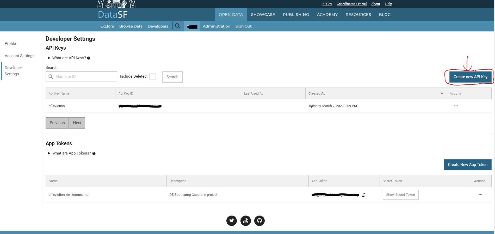

# INSTRUCTIONS TO GET YOUR SODU API KEY

Here you will find links to the documentaion pages of the API that were referenced when working on this project

* The [San Franciso Open data](https://datasf.org/opendata/) is accessible via [Socrata Open Data API](https://dev.socrata.com/) (SODA)
* The Socrata Open Data API allows you to programmatically access a wealth of open data resources from governments, non-profits, and NGOs around the world.
* [Main API Documentation Page](https://dev.socrata.com/foundry/data.sfgov.org/5cei-gny5) where you can find instructions on how to access Eviction data via the Socrata Open Data API
* We are going to extract data via API KEYS
* Signup & Get API Keys (`API_KEY_ID` & `API_KEY_SECRET`) from the [San Francisco Govt Data Website](https://data.sfgov.org/profile/edit/developer_settings)
* 
* Save the `API_KEY_ID` & `API_KEY_SECRET` to the .env file

# INSTRUCTIONS TO GET YOUR PREFECT CLOUD API
* First Create a Prefect Cloud account [Source](https://docs.prefect.io/latest/ui/cloud-api-keys/)
* Get the API as follows:   
    - To create an API key, select the account icon at the bottom-left corner of the UI and select your account name and the cog-wheel. 
    - This displays your account profile.
    - Select the API Keys tab on the left
    - Select the API Keys tab. This displays a list of previously generated keys and lets you create new API keys or delete keys.
    - Create sf_eviction key and add this data to the .env file as PREFECT_CLOUD_API